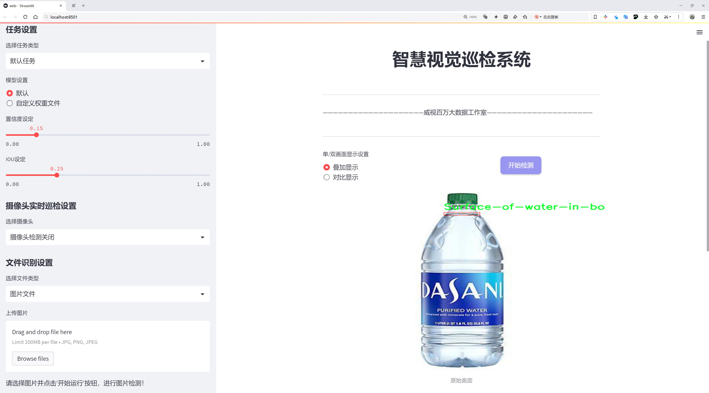
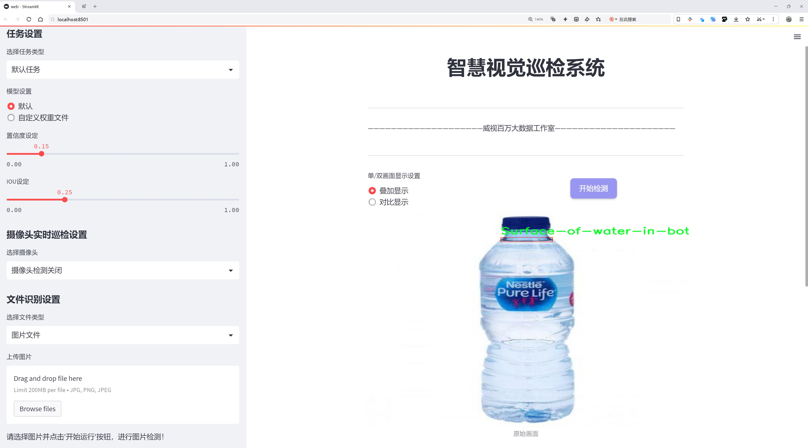

# 瓶中水位检测检测系统源码分享
 # [一条龙教学YOLOV8标注好的数据集一键训练_70+全套改进创新点发刊_Web前端展示]

### 1.研究背景与意义

项目参考[AAAI Association for the Advancement of Artificial Intelligence](https://gitee.com/qunshansj/projects)

项目来源[AACV Association for the Advancement of Computer Vision](https://gitee.com/qunmasj/projects)

研究背景与意义

随着科技的不断进步，计算机视觉技术在各个领域的应用愈发广泛，尤其是在物体检测和识别方面。近年来，深度学习算法的快速发展使得物体检测的精度和效率得到了显著提升。其中，YOLO（You Only Look Once）系列模型因其实时性和高效性，成为了物体检测领域的研究热点。YOLOv8作为该系列的最新版本，凭借其在特征提取和处理速度上的优势，展现了极大的应用潜力。然而，针对特定应用场景的改进仍然是当前研究的重要方向之一。

在实际应用中，瓶中水位的检测是一个具有重要实用价值的任务。无论是在工业生产、食品安全还是家庭日常生活中，准确监测水位不仅可以提高生产效率，还能保障使用安全。传统的水位检测方法多依赖于机械传感器或人工目测，存在精度低、响应慢、易受环境影响等缺陷。随着智能化时代的到来，基于计算机视觉的水位检测系统逐渐成为一种新兴的解决方案。通过利用图像处理和深度学习技术，可以实现对水位的高效、准确监测，进而推动相关行业的智能化转型。

本研究基于改进YOLOv8模型，构建一个高效的瓶中水位检测系统。我们使用的数据集包含2313张图像，专注于水面检测这一单一类别，旨在通过深度学习技术实现对水位的实时监测。该数据集的设计不仅涵盖了多种不同光照和背景条件下的水面图像，还考虑到了不同瓶型和水位变化的多样性，为模型的训练提供了丰富的样本支持。这种多样化的数据集能够有效提高模型的泛化能力，使其在实际应用中具备更强的适应性。

本研究的意义在于，通过对YOLOv8模型的改进，提升其在水位检测任务中的性能。具体而言，我们将探讨如何通过网络结构优化、数据增强技术和迁移学习等手段，提升模型的检测精度和实时性。此外，研究还将探讨在不同环境条件下模型的表现，以确保其在复杂场景中的有效性。这不仅为水位检测提供了一种新的解决方案，也为其他类似的视觉检测任务提供了参考。

综上所述，基于改进YOLOv8的瓶中水位检测系统的研究，不仅具有重要的理论价值，也具备广泛的应用前景。通过将深度学习与实际应用相结合，推动智能检测技术的发展，将为相关行业带来显著的效益，助力实现更高效的生产和管理模式。

### 2.图片演示






##### 注意：由于此博客编辑较早，上面“2.图片演示”和“3.视频演示”展示的系统图片或者视频可能为老版本，新版本在老版本的基础上升级如下：（实际效果以升级的新版本为准）

  （1）适配了YOLOV8的“目标检测”模型和“实例分割”模型，通过加载相应的权重（.pt）文件即可自适应加载模型。

  （2）支持“图片识别”、“视频识别”、“摄像头实时识别”三种识别模式。

  （3）支持“图片识别”、“视频识别”、“摄像头实时识别”三种识别结果保存导出，解决手动导出（容易卡顿出现爆内存）存在的问题，识别完自动保存结果并导出到tempDir中。

  （4）支持Web前端系统中的标题、背景图等自定义修改，后面提供修改教程。

  另外本项目提供训练的数据集和训练教程,暂不提供权重文件（best.pt）,需要您按照教程进行训练后实现图片演示和Web前端界面演示的效果。

### 3.视频演示

[3.1 视频演示](https://www.bilibili.com/video/BV11Q4defEqX/)

### 4.数据集信息展示

##### 4.1 本项目数据集详细数据（类别数＆类别名）

nc: 1
names: ['Surface-of-water-in-bottle']


##### 4.2 本项目数据集信息介绍

数据集信息展示

在本研究中，我们采用了名为“Fill level”的数据集，以支持改进YOLOv8模型在瓶中水位检测系统中的应用。该数据集专注于瓶中水位的检测任务，旨在通过深度学习技术实现对水位变化的精准识别与监测。数据集的类别数量为1，具体类别为“Surface-of-water-in-bottle”，这意味着该数据集专注于单一目标，即瓶中水面的位置。

“Fill level”数据集的构建过程充分考虑了多样性与代表性，确保其能够有效反映现实生活中瓶中水位的各种情况。数据集中包含了多种不同类型的瓶子，包括塑料瓶、玻璃瓶和金属瓶等，且每种瓶子在不同的光照条件、背景环境和水位高度下均有样本。这种多样性使得模型在训练过程中能够学习到更为丰富的特征，从而提高其在实际应用中的泛化能力。

数据集中的图像经过精心标注，确保每一张图像都能准确反映水面的位置。标注过程中，采用了高精度的标注工具，确保水面边缘的轮廓清晰可辨。这种精确的标注对于YOLOv8模型的训练至关重要，因为模型的性能在很大程度上依赖于训练数据的质量和准确性。通过使用该数据集，研究者能够有效地训练出一个能够快速且准确地检测瓶中水位的深度学习模型。

此外，数据集还考虑到了不同水位的变化，涵盖了从空瓶到满瓶的多个水位状态。这种全面的水位变化覆盖使得模型能够学习到不同水位对水面特征的影响，从而在实际应用中更好地适应各种水位情况。通过对这些数据的分析，模型不仅能够识别水面的位置，还能够判断水位的高低，进而为用户提供实时的水位监测信息。

在数据集的使用过程中，研究者们还进行了数据增强，以进一步提高模型的鲁棒性。通过对图像进行旋转、缩放、裁剪和颜色调整等操作，生成了更多的训练样本。这种数据增强策略不仅丰富了训练数据的多样性，还有效防止了模型的过拟合现象，使得模型在面对未见过的样本时依然能够保持良好的性能。

总之，“Fill level”数据集为改进YOLOv8在瓶中水位检测系统中的应用提供了坚实的基础。通过精确的标注、多样的样本和有效的数据增强策略，该数据集不仅提升了模型的训练效果，也为后续的实际应用奠定了良好的基础。未来，随着技术的不断进步和数据集的不断完善，我们有理由相信，基于该数据集的水位检测系统将能够在更广泛的领域中发挥重要作用。


### 5.全套项目环境部署视频教程（零基础手把手教学）

[5.1 环境部署教程链接（零基础手把手教学）](https://www.ixigua.com/7404473917358506534?logTag=c807d0cbc21c0ef59de5)


[5.2 安装Python虚拟环境创建和依赖库安装视频教程链接（零基础手把手教学）](https://www.ixigua.com/7404474678003106304?logTag=1f1041108cd1f708b01a)

### 6.手把手YOLOV8训练视频教程（零基础小白有手就能学会）

[6.1 手把手YOLOV8训练视频教程（零基础小白有手就能学会）](https://www.ixigua.com/7404477157818401292?logTag=d31a2dfd1983c9668658)

### 7.70+种全套YOLOV8创新点代码加载调参视频教程（一键加载写好的改进模型的配置文件）

[7.1 70+种全套YOLOV8创新点代码加载调参视频教程（一键加载写好的改进模型的配置文件）](https://www.ixigua.com/7404478314661806627?logTag=29066f8288e3f4eea3a4)

### 8.70+种全套YOLOV8创新点原理讲解（非科班也可以轻松写刊发刊，V10版本正在科研待更新）

由于篇幅限制，每个创新点的具体原理讲解就不一一展开，具体见下列网址中的创新点对应子项目的技术原理博客网址【Blog】：


[8.1 70+种全套YOLOV8创新点原理讲解链接](https://gitee.com/qunmasj/good)

### 9.系统功能展示（检测对象为举例，实际内容以本项目数据集为准）

图9.1.系统支持检测结果表格显示

  图9.2.系统支持置信度和IOU阈值手动调节

  图9.3.系统支持自定义加载权重文件best.pt(需要你通过步骤5中训练获得)

  图9.4.系统支持摄像头实时识别

  图9.5.系统支持图片识别

  图9.6.系统支持视频识别

  图9.7.系统支持识别结果文件自动保存

  图9.8.系统支持Excel导出检测结果数据


### 10.原始YOLOV8算法原理

原始YOLOv8算法原理

YOLOv8作为目标检测领域的最新进展，继承并发展了YOLO系列算法的优良传统，其设计理念围绕着高效性和准确性展开。YOLOv8的网络结构主要由输入层、主干网络、颈部网络和头部网络四个核心部分构成。通过对输入图像进行适当的缩放，YOLOv8能够适应不同的输入尺寸需求，从而为后续的特征提取和检测任务做好准备。

在主干网络部分，YOLOv8采用了卷积操作进行特征提取。每个卷积层都配备了批归一化和SiLU激活函数，这一设计不仅有助于加速模型的收敛速度，还能有效提高特征的表达能力。特别值得注意的是，YOLOv8引入了C2f模块，这一模块的设计灵感来源于YOLOv7中的E-ELAN结构。C2f模块通过跨层分支连接的方式，增强了模型的梯度流动，确保了信息在网络中的有效传递。这种设计使得YOLOv8在特征提取的过程中，能够更好地捕捉到图像中的重要信息，从而提升了目标检测的准确性。

在主干网络的末尾，YOLOv8引入了SPPFl（Spatial Pyramid Pooling with Feature Learning）模块，该模块通过三个最大池化层的组合，增强了网络对多尺度特征的处理能力。这一设计使得YOLOv8能够在不同尺度的目标检测中表现出色，尤其是在处理复杂场景时，能够有效地提取出多层次的特征信息。

颈部网络部分，YOLOv8依然延续了PAN-FPN的结构，旨在实现不同尺度特征图的信息融合。然而，与之前的版本不同，YOLOv8在上采样部分删除了卷积结构，这一创新设计使得网络在保持轻量化的同时，能够更有效地融合特征信息。通过这种方式，YOLOv8能够更好地整合来自主干网络的多层次特征，为后续的目标检测提供更加丰富的信息支持。

在头部网络的设计上，YOLOv8采用了目前流行的解耦合头结构。这一结构将分类和检测头分离，使得模型在处理目标检测任务时，能够更加高效地计算回归和分类损失。此外，YOLOv8将传统的Anchor-Based方法替换为Anchor-Free的设计，这一创新不仅简化了模型的复杂性，还提高了检测的灵活性和准确性。

在训练过程中，YOLOv8还采用了一系列先进的数据增强策略。例如，在训练的最后10个epoch中，关闭了马赛克增强，这一策略旨在减少训练过程中的噪声干扰，确保模型能够在更加稳定的环境中进行学习。同时，YOLOv8引入了动态Task-Aligned Assigner样本分配策略，这一策略能够根据任务的不同需求，动态调整样本的分配，从而提升模型的训练效率和效果。

在损失计算方面，YOLOv8使用了BCELoss作为分类损失，DFLLoss和CIoULoss作为回归损失。这一组合的损失函数设计，旨在更好地平衡分类和回归任务的学习，使得模型在目标检测的精度和速度上都能达到较高的水平。

YOLOv8的模型设置灵活多样，提供了n、s、m、l、x五种不同尺度的模型，以满足不同应用场景的需求。通过调整depth_factor、width_factor和ratio等参数，用户可以根据具体任务的复杂性和资源限制，选择最合适的模型配置。这种灵活性使得YOLOv8在各种硬件平台上都能实现良好的性能表现，进一步推动了其在业界的广泛应用。

总的来说，YOLOv8在设计上充分考虑了目标检测任务的多样性和复杂性，通过一系列创新的结构和策略，提升了模型的性能和适用性。无论是在精度、速度还是易用性方面，YOLOv8都展现出了其作为SOTA（State Of The Art）模型的强大实力，成为目标检测领域的一个重要里程碑。通过不断的迭代和优化，YOLOv8不仅为研究人员提供了一个强大的工具，也为实际应用中的目标检测任务提供了新的解决方案。


### 11.项目核心源码讲解（再也不用担心看不懂代码逻辑）

#### 11.1 code\ultralytics\utils\errors.py

以下是对给定代码的核心部分进行提炼和详细注释的结果：

```python
# Ultralytics YOLO 🚀, AGPL-3.0 license

from ultralytics.utils import emojis  # 导入用于处理表情符号的工具

class HUBModelError(Exception):
    """
    自定义异常类，用于处理与Ultralytics YOLO模型获取相关的错误。

    当请求的模型未找到或无法检索时，将引发此异常。
    异常消息经过处理，以包含表情符号，从而改善用户体验。

    属性:
        message (str): 当异常被引发时显示的错误消息。
    """

    def __init__(self, message="Model not found. Please check model URL and try again."):
        """
        初始化HUBModelError异常。

        参数:
            message (str): 自定义的错误消息，默认为“未找到模型。请检查模型URL并重试。”
        """
        super().__init__(emojis(message))  # 调用父类构造函数，并将消息通过emojis函数处理
```

### 代码分析与注释说明：

1. **导入模块**：
   - `from ultralytics.utils import emojis`：从`ultralytics.utils`模块中导入`emojis`函数，用于处理字符串中的表情符号。

2. **自定义异常类**：
   - `class HUBModelError(Exception)`：定义一个名为`HUBModelError`的异常类，继承自Python内置的`Exception`类。该类用于处理与模型获取相关的错误。

3. **文档字符串**：
   - 在类和方法中使用文档字符串（docstring）详细描述类的功能和属性，便于其他开发者理解该异常的用途。

4. **构造函数**：
   - `def __init__(self, message="Model not found. Please check model URL and try again.")`：定义构造函数，允许用户传入自定义的错误消息，默认消息为“未找到模型。请检查模型URL并重试。”
   - `super().__init__(emojis(message))`：调用父类的构造函数，将处理过的消息传递给父类。这里使用`emojis`函数对消息进行处理，以便在消息中添加表情符号，提升用户体验。

该代码的核心在于定义了一个用于处理模型获取错误的自定义异常类，增强了错误处理的可读性和用户体验。

这个文件定义了一个自定义异常类 `HUBModelError`，用于处理与 Ultralytics YOLO 模型获取相关的错误。该异常类继承自 Python 的内置 `Exception` 类。

在类的文档字符串中，明确了这个异常的用途：当请求的模型未找到或无法被检索时，将会引发这个异常。为了提升用户体验，异常消息会经过 `ultralytics.utils` 包中的 `emojis` 函数处理，这样可以在消息中包含表情符号，使得错误提示更加生动和友好。

构造函数 `__init__` 定义了一个默认的错误消息：“Model not found. Please check model URL and try again.”，这条消息会在模型未找到时被使用。调用 `super().__init__(emojis(message))` 的目的是先调用父类的构造函数，将处理过的消息传递给它，这样在抛出异常时，用户可以看到包含表情符号的错误信息。

总的来说，这个文件的主要功能是提供一个清晰且用户友好的方式来处理模型获取过程中可能出现的错误，确保开发者在使用 Ultralytics YOLO 时能够得到明确的反馈。

#### 11.2 ui.py

```python
import sys
import subprocess

def run_script(script_path):
    """
    使用当前 Python 环境运行指定的脚本。

    Args:
        script_path (str): 要运行的脚本路径

    Returns:
        None
    """
    # 获取当前 Python 解释器的路径
    python_path = sys.executable

    # 构建运行命令
    command = f'"{python_path}" -m streamlit run "{script_path}"'

    # 执行命令
    result = subprocess.run(command, shell=True)
    if result.returncode != 0:
        print("脚本运行出错。")


# 实例化并运行应用
if __name__ == "__main__":
    # 指定您的脚本路径
    script_path = "web.py"  # 这里直接指定脚本路径

    # 运行脚本
    run_script(script_path)  # 调用函数运行指定的脚本
```

### 代码注释说明：

1. **导入模块**：
   - `import sys`：导入系统相关的模块，用于获取当前 Python 解释器的路径。
   - `import subprocess`：导入子进程模块，用于在 Python 中执行外部命令。

2. **定义函数 `run_script`**：
   - 该函数接受一个参数 `script_path`，表示要运行的 Python 脚本的路径。
   - 使用 `sys.executable` 获取当前 Python 解释器的路径，以确保使用正确的 Python 环境来运行脚本。
   - 构建一个命令字符串，使用 `streamlit` 模块运行指定的脚本。
   - 使用 `subprocess.run` 执行构建的命令。如果返回码不为 0，表示脚本运行出错，打印错误信息。

3. **主程序入口**：
   - 使用 `if __name__ == "__main__":` 确保该部分代码仅在直接运行该脚本时执行。
   - 指定要运行的脚本路径为 `web.py`。
   - 调用 `run_script` 函数，传入脚本路径以执行该脚本。

这个程序文件名为 `ui.py`，其主要功能是通过当前的 Python 环境来运行一个指定的脚本，具体是一个名为 `web.py` 的文件。程序首先导入了必要的模块，包括 `sys`、`os` 和 `subprocess`，这些模块分别用于获取系统信息、处理文件路径和执行外部命令。

在文件中定义了一个名为 `run_script` 的函数，该函数接受一个参数 `script_path`，表示要运行的脚本的路径。函数内部首先获取当前 Python 解释器的路径，使用 `sys.executable` 来实现。接着，构建一个命令字符串，该命令使用 `streamlit` 模块来运行指定的脚本。`streamlit` 是一个用于构建数据应用的库。

构建完命令后，程序使用 `subprocess.run` 方法来执行这个命令。这个方法会在一个新的 shell 中运行命令，并等待其完成。如果命令执行的返回码不为零，表示脚本运行过程中出现了错误，程序会打印出“脚本运行出错”的提示信息。

在文件的最后部分，使用 `if __name__ == "__main__":` 语句来确保只有在直接运行该脚本时才会执行以下代码。此时，程序指定了要运行的脚本路径 `web.py`，并调用 `run_script` 函数来执行这个脚本。

总的来说，这个程序的主要作用是提供一个简单的接口来运行 `web.py` 脚本，并处理可能出现的错误。

#### 11.3 70+种YOLOv8算法改进源码大全和调试加载训练教程（非必要）\ultralytics\nn\modules\transformer.py

以下是经过简化和注释的核心代码部分，主要包括 `TransformerEncoderLayer` 和 `AIFI` 类。这些类是实现 Transformer 编码器的关键部分，包含多头自注意力机制和前馈神经网络。

```python
import torch
import torch.nn as nn
import torch.nn.functional as F

class TransformerEncoderLayer(nn.Module):
    """定义 Transformer 编码器的单层。"""

    def __init__(self, c1, cm=2048, num_heads=8, dropout=0.0, act=nn.GELU(), normalize_before=False):
        """初始化 TransformerEncoderLayer，设置参数。
        
        参数:
        - c1: 输入特征的维度
        - cm: 前馈网络中间层的维度
        - num_heads: 多头注意力的头数
        - dropout: dropout 概率
        - act: 激活函数
        - normalize_before: 是否在每个子层前进行归一化
        """
        super().__init__()
        self.ma = nn.MultiheadAttention(c1, num_heads, dropout=dropout, batch_first=True)  # 多头自注意力层
        self.fc1 = nn.Linear(c1, cm)  # 前馈网络的第一层
        self.fc2 = nn.Linear(cm, c1)  # 前馈网络的第二层

        self.norm1 = nn.LayerNorm(c1)  # 第一层归一化
        self.norm2 = nn.LayerNorm(c1)  # 第二层归一化
        self.dropout = nn.Dropout(dropout)  # dropout 层
        self.dropout1 = nn.Dropout(dropout)  # 第一层 dropout
        self.dropout2 = nn.Dropout(dropout)  # 第二层 dropout

        self.act = act  # 激活函数
        self.normalize_before = normalize_before  # 是否在前面归一化

    def forward_post(self, src, src_mask=None, src_key_padding_mask=None, pos=None):
        """后归一化的前向传播过程。"""
        q = k = src + pos if pos is not None else src  # 添加位置编码
        src2 = self.ma(q, k, value=src, attn_mask=src_mask, key_padding_mask=src_key_padding_mask)[0]  # 自注意力计算
        src = src + self.dropout1(src2)  # 残差连接
        src = self.norm1(src)  # 归一化
        src2 = self.fc2(self.dropout(self.act(self.fc1(src))))  # 前馈网络
        src = src + self.dropout2(src2)  # 残差连接
        return self.norm2(src)  # 最终归一化

    def forward(self, src, src_mask=None, src_key_padding_mask=None, pos=None):
        """前向传播，选择归一化方式。"""
        if self.normalize_before:
            return self.forward_pre(src, src_mask, src_key_padding_mask, pos)
        return self.forward_post(src, src_mask, src_key_padding_mask, pos)


class AIFI(TransformerEncoderLayer):
    """定义 AIFI Transformer 层。"""

    def __init__(self, c1, cm=2048, num_heads=8, dropout=0, act=nn.GELU(), normalize_before=False):
        """初始化 AIFI 实例，设置参数。"""
        super().__init__(c1, cm, num_heads, dropout, act, normalize_before)

    def forward(self, x):
        """AIFI Transformer 层的前向传播。"""
        c, h, w = x.shape[1:]  # 获取输入的通道数、高度和宽度
        pos_embed = self.build_2d_sincos_position_embedding(w, h, c)  # 构建 2D 正弦余弦位置编码
        x = super().forward(x.flatten(2).permute(0, 2, 1), pos=pos_embed.to(device=x.device, dtype=x.dtype))  # 前向传播
        return x.permute(0, 2, 1).view([-1, c, h, w]).contiguous()  # 还原形状

    @staticmethod
    def build_2d_sincos_position_embedding(w, h, embed_dim=256, temperature=10000.0):
        """构建 2D 正弦余弦位置编码。"""
        grid_w = torch.arange(int(w), dtype=torch.float32)  # 水平网格
        grid_h = torch.arange(int(h), dtype=torch.float32)  # 垂直网格
        grid_w, grid_h = torch.meshgrid(grid_w, grid_h, indexing='ij')  # 生成网格
        pos_dim = embed_dim // 4  # 位置维度
        omega = torch.arange(pos_dim, dtype=torch.float32) / pos_dim  # 计算 omega
        omega = 1. / (temperature ** omega)  # 归一化

        out_w = grid_w.flatten()[..., None] @ omega[None]  # 水平位置编码
        out_h = grid_h.flatten()[..., None] @ omega[None]  # 垂直位置编码

        return torch.cat([torch.sin(out_w), torch.cos(out_w), torch.sin(out_h), torch.cos(out_h)], 1)[None]  # 返回位置编码
```

### 代码说明
1. **TransformerEncoderLayer**:
   - 这是 Transformer 编码器的基本构建块，包含多头自注意力机制和前馈神经网络。
   - 提供了两种前向传播方式：后归一化和前归一化。
   - 使用残差连接和层归一化来提高训练的稳定性。

2. **AIFI**:
   - 继承自 `TransformerEncoderLayer`，增加了对 2D 正弦余弦位置编码的支持。
   - 在前向传播中处理输入的形状变化，以适应 Transformer 的输入格式。

以上代码展示了 Transformer 编码器的核心结构和位置编码的实现方式，适用于各种深度学习任务，尤其是计算机视觉中的目标检测和图像分割等任务。

这个程序文件是YOLOv8算法中用于实现Transformer模块的代码，主要包括多个类和方法，用于构建和操作Transformer网络的不同层。代码中使用了PyTorch库，定义了一系列与Transformer相关的结构，旨在增强YOLOv8的特征提取和处理能力。

首先，`TransformerEncoderLayer`类定义了Transformer编码器的单层结构。它的构造函数接受多个参数，包括输入通道数、隐藏层维度、头数、dropout率、激活函数和是否在前面进行归一化。该类实现了前向传播的方法，支持后归一化和前归一化两种模式。它使用了多头自注意力机制和前馈神经网络，并通过层归一化和dropout来增强模型的稳定性。

接下来，`AIFI`类是`TransformerEncoderLayer`的一个扩展，主要用于处理2D输入数据。它在前向传播中构建了2D的正弦余弦位置嵌入，并将输入数据进行形状转换，以适应Transformer的输入格式。

`TransformerLayer`类实现了一个简单的自注意力机制，包含线性变换和多头注意力。它的前向传播方法将输入通过自注意力层和前馈网络进行处理。

`TransformerBlock`类则是一个更复杂的结构，结合了卷积层和多个Transformer层，允许在不同的层次上进行特征提取。它的前向传播方法处理输入并返回经过Transformer层处理后的结果。

`MLPBlock`和`MLP`类实现了多层感知机（MLP）的结构，前者是一个单独的MLP块，后者则是一个完整的多层感知机，能够进行多层线性变换。

`LayerNorm2d`类实现了2D层归一化，适用于处理图像数据。它通过计算均值和方差来对输入进行归一化，并应用可学习的权重和偏置。

`MSDeformAttn`类实现了多尺度可变形注意力机制，允许模型在不同尺度上进行特征提取。它的前向传播方法根据查询、参考边界框和特征进行计算，输出经过注意力机制处理的结果。

`DeformableTransformerDecoderLayer`和`DeformableTransformerDecoder`类实现了可变形Transformer解码器的结构，前者定义了解码器的单层，后者则组合了多个解码器层。它们通过自注意力和交叉注意力机制来处理输入特征，并在每个解码步骤中生成边界框和分类结果。

总体而言，这个文件提供了YOLOv8中Transformer模块的实现，旨在通过注意力机制和多层结构来提升目标检测的性能和精度。

#### 11.4 70+种YOLOv8算法改进源码大全和调试加载训练教程（非必要）\ultralytics\models\utils\ops.py

以下是经过简化和注释的核心代码部分，主要集中在 `HungarianMatcher` 类的实现上：

```python
import torch
import torch.nn as nn
import torch.nn.functional as F
from scipy.optimize import linear_sum_assignment
from ultralytics.utils.metrics import bbox_iou

class HungarianMatcher(nn.Module):
    """
    实现匈牙利算法匹配器，用于在预测框和真实框之间进行最优匹配。
    """

    def __init__(self, cost_gain=None, use_fl=True, with_mask=False, num_sample_points=12544, alpha=0.25, gamma=2.0):
        """
        初始化 HungarianMatcher，设置成本系数和其他参数。
        """
        super().__init__()
        if cost_gain is None:
            cost_gain = {'class': 1, 'bbox': 5, 'giou': 2, 'mask': 1, 'dice': 1}
        self.cost_gain = cost_gain  # 成本系数
        self.use_fl = use_fl  # 是否使用焦点损失
        self.with_mask = with_mask  # 是否考虑掩码
        self.num_sample_points = num_sample_points  # 掩码计算的采样点数量
        self.alpha = alpha  # 焦点损失的 alpha 参数
        self.gamma = gamma  # 焦点损失的 gamma 参数

    def forward(self, pred_bboxes, pred_scores, gt_bboxes, gt_cls, gt_groups, masks=None, gt_mask=None):
        """
        前向传播，计算预测框和真实框之间的匹配。
        """
        bs, nq, nc = pred_scores.shape  # 批次大小、查询数量、类别数量

        # 如果没有真实框，返回空匹配
        if sum(gt_groups) == 0:
            return [(torch.tensor([], dtype=torch.long), torch.tensor([], dtype=torch.long)) for _ in range(bs)]

        # 扁平化预测分数和边界框
        pred_scores = pred_scores.detach().view(-1, nc)
        pred_scores = F.sigmoid(pred_scores) if self.use_fl else F.softmax(pred_scores, dim=-1)
        pred_bboxes = pred_bboxes.detach().view(-1, 4)

        # 计算分类成本
        pred_scores = pred_scores[:, gt_cls]
        if self.use_fl:
            neg_cost_class = (1 - self.alpha) * (pred_scores ** self.gamma) * (-(1 - pred_scores + 1e-8).log())
            pos_cost_class = self.alpha * ((1 - pred_scores) ** self.gamma) * (-(pred_scores + 1e-8).log())
            cost_class = pos_cost_class - neg_cost_class
        else:
            cost_class = -pred_scores

        # 计算边界框之间的 L1 成本
        cost_bbox = (pred_bboxes.unsqueeze(1) - gt_bboxes.unsqueeze(0)).abs().sum(-1)

        # 计算 GIoU 成本
        cost_giou = 1.0 - bbox_iou(pred_bboxes.unsqueeze(1), gt_bboxes.unsqueeze(0), xywh=True, GIoU=True).squeeze(-1)

        # 最终成本矩阵
        C = self.cost_gain['class'] * cost_class + \
            self.cost_gain['bbox'] * cost_bbox + \
            self.cost_gain['giou'] * cost_giou

        # 处理掩码成本（如果需要）
        if self.with_mask:
            C += self._cost_mask(bs, gt_groups, masks, gt_mask)

        # 将无效值（NaN 和无穷大）设置为 0
        C[C.isnan() | C.isinf()] = 0.0

        C = C.view(bs, nq, -1).cpu()  # 将成本矩阵重塑为 [batch_size, num_queries, num_gt]
        indices = [linear_sum_assignment(c[i]) for i, c in enumerate(C.split(gt_groups, -1))]  # 进行匈牙利算法匹配
        gt_groups = torch.as_tensor([0, *gt_groups[:-1]]).cumsum_(0)  # 计算每个批次的真实框组索引

        # 返回匹配的索引
        return [(torch.tensor(i, dtype=torch.long), torch.tensor(j, dtype=torch.long) + gt_groups[k])
                for k, (i, j) in enumerate(indices)]
```

### 代码说明：
1. **HungarianMatcher 类**：实现了一个用于计算预测框和真实框之间最优匹配的模块，使用匈牙利算法。
2. **初始化方法**：设置成本系数、是否使用焦点损失、是否考虑掩码等参数。
3. **forward 方法**：主要逻辑在这里，计算预测框和真实框之间的分类成本、L1成本和GIoU成本，并生成最终的成本矩阵。
4. **成本计算**：通过将预测分数和真实类别进行匹配，计算分类成本；通过计算边界框之间的距离计算L1成本；通过计算GIoU来评估框的重叠程度。
5. **匈牙利算法匹配**：使用 `linear_sum_assignment` 函数进行最优匹配，返回匹配的索引。

以上是代码的核心部分和详细注释，帮助理解其功能和实现方式。

这个程序文件实现了一个名为 `HungarianMatcher` 的类，主要用于解决目标检测中的分配问题。该类通过匈牙利算法对预测的边界框和真实的边界框进行最优匹配。它的核心功能是计算一个代价矩阵，该矩阵基于分类得分、边界框坐标以及可选的掩码预测，来评估预测与真实值之间的匹配程度。

在初始化方法中，`HungarianMatcher` 接受多个参数，包括代价系数、是否使用焦点损失、是否进行掩码预测、样本点数量以及焦点损失的超参数（alpha 和 gamma）。这些参数用于调整代价计算的权重和行为。

`forward` 方法是该类的主要功能，它接收预测的边界框、得分、真实的边界框、类别、组信息以及可选的掩码数据。该方法首先处理输入数据，计算分类代价、边界框的 L1 距离代价和 GIoU（广义交并比）代价。然后，它根据这些代价计算最终的代价矩阵，并使用匈牙利算法找到最佳匹配。最终返回的是一个包含每个批次中选择的预测和真实目标索引的列表。

此外，文件中还定义了一个 `get_cdn_group` 函数，用于创建对比去噪训练组。该函数通过对真实标签和边界框施加噪声，生成正负样本，并返回修改后的标签、边界框、注意力掩码和元信息。这个函数在训练过程中用于增强模型的鲁棒性。

总体而言，这个文件实现了目标检测中的重要算法，提供了高效的匹配机制，并为训练过程中的数据增强提供了支持。

#### 11.5 code\ultralytics\trackers\utils\gmc.py

以下是经过简化和注释的核心代码部分：

```python
import cv2
import numpy as np

class GMC:
    """
    通用运动补偿 (GMC) 类，用于视频帧中的跟踪和物体检测。
    """

    def __init__(self, method: str = "sparseOptFlow", downscale: int = 2) -> None:
        """
        初始化视频跟踪器，指定跟踪方法和下采样因子。

        Args:
            method (str): 使用的跟踪方法，包括 'orb', 'sift', 'ecc', 'sparseOptFlow', 'none'。
            downscale (int): 处理帧的下采样因子。
        """
        self.method = method
        self.downscale = max(1, int(downscale))  # 确保下采样因子至少为1

        # 根据选择的跟踪方法初始化相应的检测器和匹配器
        if self.method == "orb":
            self.detector = cv2.FastFeatureDetector_create(20)
            self.extractor = cv2.ORB_create()
            self.matcher = cv2.BFMatcher(cv2.NORM_HAMMING)
        elif self.method == "sift":
            self.detector = cv2.SIFT_create()
            self.extractor = cv2.SIFT_create()
            self.matcher = cv2.BFMatcher(cv2.NORM_L2)
        elif self.method == "ecc":
            self.warp_mode = cv2.MOTION_EUCLIDEAN
            self.criteria = (cv2.TERM_CRITERIA_EPS | cv2.TERM_CRITERIA_COUNT, 5000, 1e-6)
        elif self.method == "sparseOptFlow":
            self.feature_params = dict(maxCorners=1000, qualityLevel=0.01, minDistance=1, blockSize=3)
        elif self.method in {"none", "None", None}:
            self.method = None
        else:
            raise ValueError(f"未知的 GMC 方法: {method}")

        # 初始化存储前一帧和关键点的变量
        self.prevFrame = None
        self.prevKeyPoints = None
        self.prevDescriptors = None
        self.initializedFirstFrame = False

    def apply(self, raw_frame: np.array) -> np.array:
        """
        根据指定的方法对原始帧进行处理。

        Args:
            raw_frame (np.array): 要处理的原始帧。

        Returns:
            (np.array): 处理后的帧。
        """
        if self.method in ["orb", "sift"]:
            return self.applyFeatures(raw_frame)
        elif self.method == "ecc":
            return self.applyEcc(raw_frame)
        elif self.method == "sparseOptFlow":
            return self.applySparseOptFlow(raw_frame)
        else:
            return np.eye(2, 3)  # 返回单位矩阵

    def applyEcc(self, raw_frame: np.array) -> np.array:
        """
        使用ECC算法处理原始帧。

        Args:
            raw_frame (np.array): 要处理的原始帧。

        Returns:
            (np.array): 处理后的帧。
        """
        height, width, _ = raw_frame.shape
        frame = cv2.cvtColor(raw_frame, cv2.COLOR_BGR2GRAY)  # 转换为灰度图
        H = np.eye(2, 3, dtype=np.float32)  # 初始化变换矩阵

        # 下采样图像
        if self.downscale > 1.0:
            frame = cv2.resize(frame, (width // self.downscale, height // self.downscale))

        # 处理第一帧
        if not self.initializedFirstFrame:
            self.prevFrame = frame.copy()  # 保存当前帧
            self.initializedFirstFrame = True
            return H

        # 使用ECC算法计算变换矩阵
        try:
            (cc, H) = cv2.findTransformECC(self.prevFrame, frame, H, self.warp_mode, self.criteria)
        except Exception as e:
            print(f"警告: 变换计算失败，使用单位矩阵 {e}")

        return H

    def applyFeatures(self, raw_frame: np.array) -> np.array:
        """
        使用特征检测方法（如ORB或SIFT）处理原始帧。

        Args:
            raw_frame (np.array): 要处理的原始帧。

        Returns:
            (np.array): 处理后的帧。
        """
        height, width, _ = raw_frame.shape
        frame = cv2.cvtColor(raw_frame, cv2.COLOR_BGR2GRAY)  # 转换为灰度图
        H = np.eye(2, 3)  # 初始化变换矩阵

        # 下采样图像
        if self.downscale > 1.0:
            frame = cv2.resize(frame, (width // self.downscale, height // self.downscale))

        # 检测关键点
        keypoints = self.detector.detect(frame)

        # 处理第一帧
        if not self.initializedFirstFrame:
            self.prevFrame = frame.copy()
            self.prevKeyPoints = keypoints
            self.initializedFirstFrame = True
            return H

        # 计算描述符并匹配
        keypoints, descriptors = self.extractor.compute(frame, keypoints)
        knnMatches = self.matcher.knnMatch(self.prevDescriptors, descriptors, 2)

        # 过滤匹配
        goodMatches = [m for m, n in knnMatches if m.distance < 0.9 * n.distance]

        # 计算变换矩阵
        if len(goodMatches) > 4:
            prevPoints = np.array([self.prevKeyPoints[m.queryIdx].pt for m in goodMatches])
            currPoints = np.array([keypoints[m.trainIdx].pt for m in goodMatches])
            H, _ = cv2.estimateAffinePartial2D(prevPoints, currPoints, cv2.RANSAC)

        self.prevFrame = frame.copy()
        self.prevKeyPoints = keypoints
        self.prevDescriptors = descriptors

        return H

    def applySparseOptFlow(self, raw_frame: np.array) -> np.array:
        """
        使用稀疏光流方法处理原始帧。

        Args:
            raw_frame (np.array): 要处理的原始帧。

        Returns:
            (np.array): 处理后的帧。
        """
        height, width, _ = raw_frame.shape
        frame = cv2.cvtColor(raw_frame, cv2.COLOR_BGR2GRAY)  # 转换为灰度图
        H = np.eye(2, 3)  # 初始化变换矩阵

        # 下采样图像
        if self.downscale > 1.0:
            frame = cv2.resize(frame, (width // self.downscale, height // self.downscale))

        # 检测关键点
        keypoints = cv2.goodFeaturesToTrack(frame, mask=None, **self.feature_params)

        # 处理第一帧
        if not self.initializedFirstFrame:
            self.prevFrame = frame.copy()
            self.prevKeyPoints = keypoints
            self.initializedFirstFrame = True
            return H

        # 计算光流
        matchedKeypoints, status, _ = cv2.calcOpticalFlowPyrLK(self.prevFrame, frame, self.prevKeyPoints, None)

        # 过滤有效匹配
        prevPoints = np.array([self.prevKeyPoints[i] for i in range(len(status)) if status[i]])
        currPoints = np.array([matchedKeypoints[i] for i in range(len(status)) if status[i]])

        # 计算变换矩阵
        if len(prevPoints) > 4:
            H, _ = cv2.estimateAffinePartial2D(prevPoints, currPoints, cv2.RANSAC)

        self.prevFrame = frame.copy()
        self.prevKeyPoints = keypoints

        return H
```

### 代码注释说明：
1. **类和方法**：定义了一个名为 `GMC` 的类，包含了初始化方法和多个应用方法，用于处理视频帧。
2. **初始化方法**：根据选择的跟踪方法（如ORB、SIFT、ECC、稀疏光流）初始化相应的检测器和匹配器，并设置下采样因子。
3. **应用方法**：根据选择的跟踪方法调用相应的处理函数，处理原始帧并返回变换矩阵。
4. **ECC和特征方法**：实现了ECC算法和特征检测方法的具体逻辑，包括图像预处理、关键点检测、描述符计算和匹配。
5. **稀疏光流方法**：实现了稀疏光流的处理逻辑，计算光流并提取有效匹配的关键点。

通过这些注释，可以更清晰地理解代码的功能和结构。

这个程序文件定义了一个名为 `GMC` 的类，主要用于视频帧中的目标跟踪和检测。该类实现了多种跟踪算法，包括 ORB、SIFT、ECC 和稀疏光流，能够根据需要对帧进行降采样以提高计算效率。

在类的初始化方法 `__init__` 中，用户可以指定所使用的跟踪方法和降采样因子。根据选择的跟踪方法，程序会初始化相应的特征检测器、描述符提取器和匹配器。例如，如果选择了 ORB 方法，则会创建一个 ORB 特征提取器和一个基于汉明距离的匹配器；如果选择了 SIFT 方法，则会使用 SIFT 特征提取器和基于欧几里得距离的匹配器。

类中有多个方法，最主要的是 `apply` 方法，它根据当前选择的跟踪方法对输入的原始帧进行处理，并返回处理后的帧。具体的处理逻辑则由 `applyEcc`、`applyFeatures` 和 `applySparseOptFlow` 方法实现。这些方法分别实现了 ECC 算法、特征基方法（如 ORB 或 SIFT）和稀疏光流方法。

在 `applyEcc` 方法中，首先将输入帧转换为灰度图像，并进行降采样处理。若是第一次处理帧，则会初始化上一帧数据。随后，使用 `cv2.findTransformECC` 函数计算当前帧与上一帧之间的变换矩阵。

`applyFeatures` 方法则通过检测关键点并计算描述符来进行处理。它会根据输入的检测结果创建一个掩膜，以避免在检测框内进行特征提取。然后，它会匹配当前帧和上一帧的描述符，并使用 RANSAC 算法估计出一个刚性变换矩阵。

`applySparseOptFlow` 方法实现了稀疏光流的计算。它同样会将输入帧转换为灰度图像，并使用 `cv2.goodFeaturesToTrack` 方法检测关键点。通过 `cv2.calcOpticalFlowPyrLK` 函数找到关键点之间的对应关系，并计算变换矩阵。

此外，类中还包含一个 `reset_params` 方法，用于重置跟踪器的参数，以便在需要时重新初始化。

整体来看，这个类提供了一种灵活的方式来实现视频中的目标跟踪和运动补偿，用户可以根据具体需求选择不同的跟踪算法，并通过降采样来优化性能。

#### 11.6 70+种YOLOv8算法改进源码大全和调试加载训练教程（非必要）\ultralytics\trackers\bot_sort.py

以下是代码中最核心的部分，并附上详细的中文注释：

```python
class BOTrack(STrack):
    """
    BOTrack类是STrack类的扩展版本，添加了物体跟踪功能。
    """

    shared_kalman = KalmanFilterXYWH()  # 所有BOTrack实例共享的卡尔曼滤波器

    def __init__(self, tlwh, score, cls, feat=None, feat_history=50):
        """初始化BOTrack实例，设置初始参数，包括特征历史记录、平滑因子和当前特征。"""
        super().__init__(tlwh, score, cls)  # 调用父类构造函数

        self.smooth_feat = None  # 平滑特征向量
        self.curr_feat = None  # 当前特征向量
        if feat is not None:
            self.update_features(feat)  # 更新特征
        self.features = deque([], maxlen=feat_history)  # 存储特征向量的双端队列
        self.alpha = 0.9  # 指数移动平均的平滑因子

    def update_features(self, feat):
        """更新特征向量，并使用指数移动平均进行平滑处理。"""
        feat /= np.linalg.norm(feat)  # 归一化特征向量
        self.curr_feat = feat  # 更新当前特征
        if self.smooth_feat is None:
            self.smooth_feat = feat  # 如果平滑特征为空，则直接赋值
        else:
            # 使用指数移动平均更新平滑特征
            self.smooth_feat = self.alpha * self.smooth_feat + (1 - self.alpha) * feat
        self.features.append(feat)  # 将特征添加到队列中
        self.smooth_feat /= np.linalg.norm(self.smooth_feat)  # 归一化平滑特征

    def predict(self):
        """使用卡尔曼滤波器预测均值和协方差。"""
        mean_state = self.mean.copy()  # 复制当前均值状态
        if self.state != TrackState.Tracked:
            mean_state[6] = 0  # 如果状态不是被跟踪，则将速度设置为0
            mean_state[7] = 0

        # 通过卡尔曼滤波器进行预测
        self.mean, self.covariance = self.kalman_filter.predict(mean_state, self.covariance)

    @property
    def tlwh(self):
        """获取当前边界框位置，格式为 (左上角 x, 左上角 y, 宽度, 高度)。"""
        if self.mean is None:
            return self._tlwh.copy()  # 如果均值为空，返回初始值
        ret = self.mean[:4].copy()  # 复制均值的前四个元素
        ret[:2] -= ret[2:] / 2  # 计算左上角坐标
        return ret  # 返回计算后的边界框

class BOTSORT(BYTETracker):
    """
    BOTSORT类是BYTETracker类的扩展版本，设计用于使用ReID和GMC算法进行物体跟踪。
    """

    def __init__(self, args, frame_rate=30):
        """初始化BOTSORT实例，设置ReID模块和GMC算法。"""
        super().__init__(args, frame_rate)  # 调用父类构造函数
        self.proximity_thresh = args.proximity_thresh  # 空间接近阈值
        self.appearance_thresh = args.appearance_thresh  # 外观相似性阈值

        if args.with_reid:
            self.encoder = None  # 如果启用ReID，初始化编码器
        self.gmc = GMC(method=args.gmc_method)  # 初始化GMC算法实例

    def init_track(self, dets, scores, cls, img=None):
        """使用检测结果、分数和类别初始化跟踪。"""
        if len(dets) == 0:
            return []  # 如果没有检测结果，返回空列表
        if self.args.with_reid and self.encoder is not None:
            features_keep = self.encoder.inference(img, dets)  # 进行ReID特征提取
            return [BOTrack(xyxy, s, c, f) for (xyxy, s, c, f) in zip(dets, scores, cls, features_keep)]  # 返回带特征的BOTrack实例
        else:
            return [BOTrack(xyxy, s, c) for (xyxy, s, c) in zip(dets, scores, cls)]  # 返回不带特征的BOTrack实例

    def multi_predict(self, tracks):
        """使用YOLOv8模型预测和跟踪多个物体。"""
        BOTrack.multi_predict(tracks)  # 调用BOTrack的多重预测方法
```

### 代码核心部分说明：
1. **BOTrack类**：扩展了STrack类，增加了特征更新、预测和状态管理的功能。
2. **共享卡尔曼滤波器**：所有BOTrack实例共享一个卡尔曼滤波器，以提高跟踪精度。
3. **特征更新**：通过指数移动平均平滑特征向量，增强跟踪稳定性。
4. **预测功能**：使用卡尔曼滤波器进行状态预测，适应物体运动。
5. **BOTSORT类**：扩展了BYTETracker，增加了ReID和GMC算法的支持，用于物体跟踪。

这个程序文件主要实现了YOLOv8算法中的对象跟踪功能，具体来说，它定义了两个类：`BOTrack`和`BOTSORT`，用于扩展YOLOv8的跟踪能力。

`BOTrack`类是对`STrack`类的扩展，增加了对象跟踪的特性。它包含多个属性和方法，用于处理对象的特征、状态预测和坐标转换等。属性中，`shared_kalman`是一个共享的卡尔曼滤波器实例，用于所有`BOTrack`实例的状态预测。`smooth_feat`和`curr_feat`分别表示平滑后的特征向量和当前特征向量，`features`是一个双端队列，用于存储特征向量，`alpha`是用于指数移动平均的平滑因子。`mean`和`covariance`分别表示卡尔曼滤波器的均值状态和协方差矩阵。

在方法方面，`update_features`用于更新特征向量并使用指数移动平均进行平滑处理；`predict`方法使用卡尔曼滤波器预测当前状态；`re_activate`方法用于重新激活一个跟踪实例；`update`方法则更新YOLOv8实例与新的跟踪信息；`tlwh`属性返回当前的边界框位置；`multi_predict`方法用于对多个对象轨迹进行预测；`convert_coords`和`tlwh_to_xywh`方法用于坐标格式的转换。

`BOTSORT`类是对`BYTETracker`类的扩展，专为YOLOv8设计，支持对象跟踪和ReID（重识别）算法。它的属性包括空间接近阈值和外观相似性阈值，以及用于处理ReID嵌入的编码器和GMC算法的实例。方法方面，`get_kalmanfilter`返回一个卡尔曼滤波器实例，`init_track`用于初始化跟踪，`get_dists`计算轨迹与检测之间的距离，`multi_predict`则用于对多个对象进行预测和跟踪。

整体来看，这个文件实现了YOLOv8的对象跟踪功能，通过卡尔曼滤波器和ReID算法，提升了跟踪的准确性和鲁棒性。用户可以通过创建`BOTSORT`实例并调用相关方法来进行对象跟踪。

### 12.系统整体结构（节选）

### 整体功能和构架概括

该项目主要围绕YOLOv8目标检测算法的实现与扩展，提供了一系列工具和模块来支持目标检测、跟踪、特征提取、模型训练等功能。项目结构清晰，各个模块相互协作，形成了一个完整的目标检测和跟踪系统。

- **目标检测**：通过YOLOv8模型实现实时目标检测，支持多种输入数据格式。
- **特征提取与匹配**：使用Transformer和其他神经网络结构提取特征，并通过匈牙利算法进行目标匹配。
- **目标跟踪**：实现了多种跟踪算法（如BOTSORT），支持在视频流中对目标进行持续跟踪。
- **用户界面**：提供了简单的用户界面，便于用户进行模型训练和检测结果的可视化。
- **错误处理**：通过自定义异常类，提升了错误处理的友好性和可读性。

### 文件功能整理表

| 文件路径                                                                                                      | 功能描述                                                                                   |
|---------------------------------------------------------------------------------------------------------------|--------------------------------------------------------------------------------------------|
| `code\ultralytics\utils\errors.py`                                                                           | 定义了自定义异常类 `HUBModelError`，用于处理模型获取相关的错误。                          |
| `ui.py`                                                                                                      | 提供一个接口来运行 `web.py` 脚本，处理目标检测和跟踪的用户界面。                          |
| `70+种YOLOv8算法改进源码大全和调试加载训练教程（非必要）\ultralytics\nn\modules\transformer.py`              | 实现了Transformer模块，增强YOLOv8的特征提取能力，包括编码器和解码器的实现。              |
| `70+种YOLOv8算法改进源码大全和调试加载训练教程（非必要）\ultralytics\models\utils\ops.py`                 | 实现了 `HungarianMatcher` 类，用于目标检测中的最优匹配，支持代价矩阵计算和数据增强。      |
| `code\ultralytics\trackers\utils\gmc.py`                                                                    | 定义了 `GMC` 类，提供多种跟踪算法（如ORB、SIFT、ECC等）用于视频帧中的目标跟踪。           |
| `70+种YOLOv8算法改进源码大全和调试加载训练教程（非必要）\ultralytics\trackers\bot_sort.py`                | 实现了对象跟踪功能，定义了 `BOTrack` 和 `BOTSORT` 类，结合卡尔曼滤波和ReID算法。        |
| `70+种YOLOv8算法改进源码大全和调试加载训练教程（非必要）\ultralytics\models\yolo\detect\predict.py`       | 负责YOLOv8模型的预测功能，处理输入数据并返回检测结果。                                   |
| `70+种YOLOv8算法改进源码大全和调试加载训练教程（非必要）\ultralytics\engine\__init__.py`                | 初始化引擎模块，整合其他模块以便于模型的训练和推理。                                       |
| `code\ultralytics\models\fastsam\utils.py`                                                                  | 提供了与FastSAM模型相关的工具函数，支持特征提取和处理。                                   |
| `train.py`                                                                                                   | 负责模型的训练过程，整合数据加载、模型训练和评估功能。                                     |
| `code\ultralytics\engine\model.py`                                                                          | 定义了模型的结构和前向传播逻辑，支持YOLOv8模型的构建和训练。                               |
| `code\ultralytics\data\explorer\gui\dash.py`                                                               | 提供数据可视化和用户交互界面，便于用户查看检测结果和模型性能。                             |

以上表格总结了每个文件的主要功能，帮助理解项目的整体架构和各个模块之间的关系。

注意：由于此博客编辑较早，上面“11.项目核心源码讲解（再也不用担心看不懂代码逻辑）”中部分代码可能会优化升级，仅供参考学习，完整“训练源码”、“Web前端界面”和“70+种创新点源码”以“13.完整训练+Web前端界面+70+种创新点源码、数据集获取”的内容为准。

### 13.完整训练+Web前端界面+70+种创新点源码、数据集获取


# [下载链接：https://mbd.pub/o/bread/ZpuWkphp](https://mbd.pub/o/bread/ZpuWkphp)